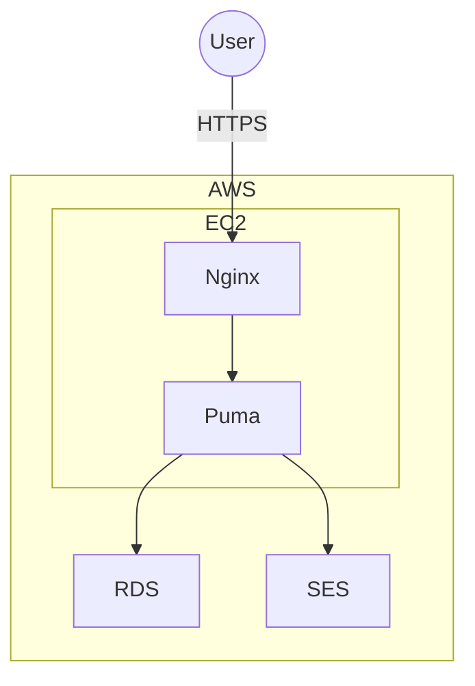

# Pawth 🐾

## 〜日々の足あとを描く〜

Pawth は、1日1投稿の小さな日記アプリです。  
日々の歩みを可視化し、その日の記録にコミットするための制約設計を大切にしています。

> 🌐 紹介サイト: <https://pawth-lp.hamltail.dev/>

⚠️ 現在、本番環境の公開は停止しています。

> 🟢 本番: https://pawth.hamltail.dev <br>
> 🟢 サンプルユーザー: https://pawth.hamltail.dev/user1 〜 /user10 <br>
> 　　　　　　　　　（ログイン不要で閲覧可能）

## 目次

- [Pawth 🐾](#pawth-)
  - [〜日々の足あとを描く〜](#日々の足あとを描く)
  - [目次](#目次)
  - [コンセプト](#コンセプト)
    - [1日1投稿まで](#1日1投稿まで)
    - [SNS化しない](#sns化しない)
  - [技術スタック](#技術スタック)
  - [セットアップ（ローカル）](#セットアップローカル)
  - [Dockerで開発環境を立ち上げる場合](#dockerで開発環境を立ち上げる場合)
  - [テスト（RSpec / E2E: Playwright）](#テストrspec--e2e-playwright)
    - [RSpec](#rspec)
    - [Playwright](#playwright)
  - [クラウド構成](#クラウド構成)
  - [テストデータと画像の取り扱い](#テストデータと画像の取り扱い)
  - [ライセンス](#ライセンス)
  - [Author](#author)

---

## コンセプト

### 1日1投稿まで

- 当日内は削除不可
- 編集は最大3回まで
- 翌日以降は削除可能（ただし編集不可）

> その日の自分にコミットすること。

### SNS化しない

- タイムラインなし
- フォロー / フォロワー機能なし
- 日記は公開・非公開を選択可能

> 他者との比較ではなく、内省に最適化すること。

---

## 技術スタック

| Category       | Technology                      |
| -------------- | ------------------------------- |
| Backend        | Ruby 3.4, Rails 8               |
| Database       | PostgreSQL 17                   |
| Authentication | Devise                          |
| Frontend       | Haml, Tailwind CSS, Turbo, GSAP |
| Testing        | RSpec, FactoryBot               |
| E2E Testing    | Playwright, axe-core            |
| Infrastructure | AWS (EC2, RDS, SES)             |

---

## セットアップ（ローカル）

```
git clone https://github.com/hamltail/pawth.git
cd pawth
bundle install
rails db:setup
bin/dev
```

## Dockerで開発環境を立ち上げる場合

初回ビルド & 起動

```
docker compose -f compose.dev.yml up --build -d
```

DB準備（作成 + マイグレーション）

```
docker compose -f compose.dev.yml exec web bash -lc "bin/rails db:setup"
```

ログ

```
docker compose -f compose.dev.yml logs -f web
```

停止

```
docker compose -f compose.dev.yml down
```

## テスト（RSpec / E2E: Playwright）

### RSpec

```
bundle exec rspec
```

### Playwright

Pawth 直下に e2e/ を置いています。初回はブラウザ依存をインストールしてください。

```
cd e2e
npm ci
npm run install:browsers
```

E2E実行

```
cd e2e
npm test           # ヘッドレス
npm run headed     # 画面表示あり
npm run debug      # Playwright Inspector
```

直近のテストトレースを開く

```
npm run trace
```

## クラウド構成

AWS構成（EC2 / RDS / SES）



## テストデータと画像の取り扱い

本アプリでは、テストデータのプロフィール画像として以下を使用しています。

- ACイラスト
- Sour式ミク / Sour式リン（著者が描いた絵を使用）

## ライセンス

このリポジトリは、ポートフォリオ目的で公開しています。

著作権は作者に帰属します。
無断転載・再配布・商用利用はご遠慮ください。

This repository is published for portfolio purposes only.

All rights to the content belong to the author.

Please do not reproduce, redistribute, or use any part of this project for commercial purposes without permission.

## Author

- h-waji (hamltail)
