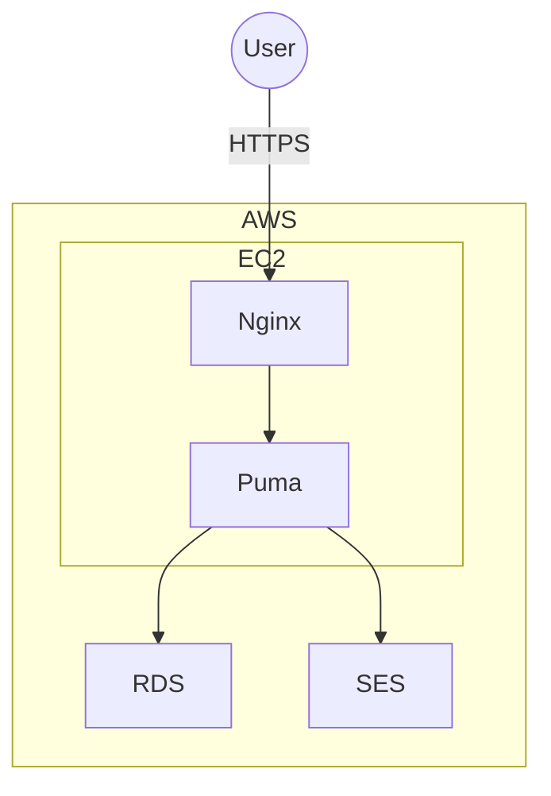

# Pawth 🐾

## 〜日々の足あとを描く〜

Pawth は、1日1投稿の小さな日記アプリです。  
毎日の歩みを可視化し、その日の記録にコミットするための制約設計を大切にしています。

> 🟢 本番: https://pawth.hamltail.dev <br>
> 🟢 サンプルユーザー: https://pawth.hamltail.dev/user1 〜 /user10 <br>
> 　　　　　　　　　（ログイン不要で閲覧可能）

## 目次

- [コンセプト / 非採用機能](#コンセプト--非採用機能)
- [技術スタック](#技術スタック)
- [セットアップ（ローカル）](#セットアップローカル)
- [Dockerでの起動](#dockerで開発環境を立ち上げる場合)
- [テスト（RSpec / E2E: Playwright）](#rspec--e2e-playwright)
- [クラウド構成](#クラウド構成)
- [テストデータと画像の取り扱い](#テストデータと画像の取り扱い)
- [ライセンス](#ライセンス)
- [著者](#著者)

---

## コンセプト / 非採用機能

- **1日1投稿まで**
  - 当日内は削除不可 / 編集は最大3回まで
  - 翌日以降は削除可（ただし編集不可）
  - 目的: その日の自分にコミット
- **SNS化はしない**
  - タイムライン、フォロー/フォロワーは未実装 / 非採用
  - 日記は 非公開/公開 を選択可能。内省に最適化

---

## 技術スタック

- **Backend**: Ruby 3.4.4 / Rails 8.0.2
- **DB**: PostgreSQL 14.x
- **Auth**: Devise
- **Frontend**: Haml, Tailwind CSS, Turbo, GSAP
- **Test**: RSpec, FactoryBot
- **E2E**: Playwright (+ axe-core によるアクセシビリティ検査)
- **Infra(本番)**: AWS（EC2 / RDS / SES）

---

## セットアップ（ローカル）

```
git clone https://github.com/hamltail/pawth.git
cd pawth
bundle install
rails db:setup
bin/dev
```

## Dockerで開発環境を立ち上げる場合

初回ビルド & 起動

```
docker compose -f compose.dev.yml up --build -d
```

DB準備（作成 + マイグレーション）

```
docker compose -f compose.dev.yml exec web bash -lc "bin/rails db:prepare"
```

ログ

```
docker compose -f compose.dev.yml logs -f web
```

停止

```
docker compose -f compose.dev.yml down
```

## （RSpec / E2E: Playwright）

### RSpec

```
bundle exec rspec
```

### Playwright

Pawth 直下に e2e/ を置いています。初回はブラウザ依存をインストールしてください。

```
cd e2e
npm ci
npm run install:browsers
```

E2E実行

```
cd e2e
npm test           # ヘッドレス
npm run headed     # 画面表示あり
npm run debug      # Playwright Inspector
```

直近のテストトレースを開く

```
npm run trace
```

## クラウド構成

AWSのシンプル構成（EC2 / RDS / SES）



## テストデータと画像の取り扱い

本アプリでは、テストデータのプロフィール画像として以下を使用しています。

- ACイラスト
- Sour式ミク / Sour式リン（著者が描いた絵を使用）

## ライセンス

このプロジェクトは MIT License で提供されます。

ただし本ソフトウェアは無保証であり、使用により発生した問題については、著者はいかなる責任も負いません。

## 著者

- h-waji (@hamltail)
