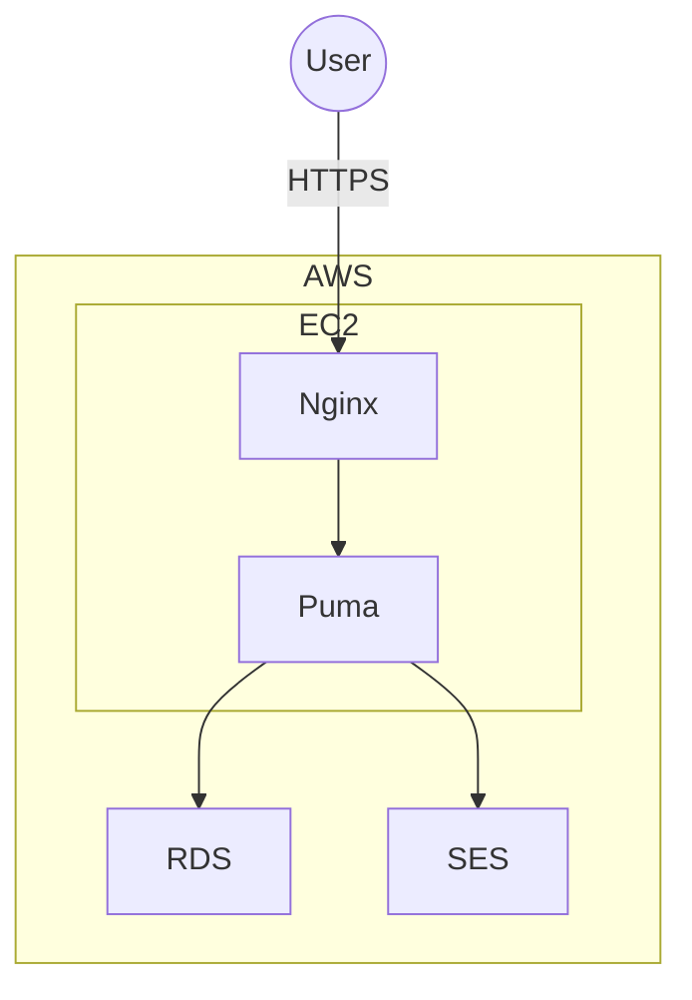

# Pawth 🐾

## 〜日々の足あとを描く〜

Pawth は、1日1投稿の小さな日記アプリです。  
日々の歩みを可視化し、その日の記録にコミットするための制約設計を大切にしています。

> 🌐 紹介サイト: <https://pawth-lp.hamltail.dev/>

⚠️ 現在、本番環境の公開は停止しています。

## Current Status

- コア機能の開発は完了しています。
- 現在は保守・メンテナンスを行っています。

## 目次

- [Pawth 🐾](#pawth-)
  - [〜日々の足あとを描く〜](#日々の足あとを描く)
  - [Current Status](#current-status)
  - [目次](#目次)
  - [コンセプト](#コンセプト)
    - [1日1投稿まで](#1日1投稿まで)
    - [SNS化しない](#sns化しない)
  - [技術スタック](#技術スタック)
  - [セットアップ（ローカル）](#セットアップローカル)
  - [Dockerで開発環境を立ち上げる場合](#dockerで開発環境を立ち上げる場合)
    - [初回ビルド \& 起動](#初回ビルド--起動)
    - [DB のセットアップ](#db-のセットアップ)
    - [初回ユーザー登録](#初回ユーザー登録)
    - [ログの確認](#ログの確認)
    - [停止](#停止)
  - [テスト・コードチェック](#テストコードチェック)
    - [テスト構成](#テスト構成)
    - [テストをまとめて実行](#テストをまとめて実行)
    - [Unit Test（RSpec）](#unit-testrspec)
    - [E2E Test（Playwright）](#e2e-testplaywright)
    - [E2E のデバッグ](#e2e-のデバッグ)
  - [クラウド構成](#クラウド構成)
  - [License](#license)
  - [Author](#author)

---

## コンセプト

### 1日1投稿まで

- 当日内は削除不可
- 編集は最大3回まで
- 翌日以降は削除可能（ただし編集不可）

> その日の自分にコミットすること。

### SNS化しない

- タイムラインなし
- フォロー / フォロワー機能なし
- 日記は公開・非公開を選択可能

> 他者との比較ではなく、内省に最適化すること。

---

## 技術スタック

| Category       | Technology                      |
| -------------- | ------------------------------- |
| Backend        | Ruby 4.0.6, Rails 8.1.3         |
| Database       | PostgreSQL 18                   |
| Authentication | Devise                          |
| Frontend       | Haml, Tailwind CSS, Turbo, GSAP |
| Testing        | RSpec, FactoryBot               |
| E2E Testing    | Playwright, axe-core            |
| Infrastructure | AWS (EC2, RDS, SES)             |

---

## セットアップ（ローカル）

```bash
git clone https://github.com/hamltail/pawth.git
cd pawth
bundle install
npm ci
rails db:setup
bin/dev
```

## Dockerで開発環境を立ち上げる場合

### 初回ビルド & 起動

```bash
docker compose -f compose.dev.yml up --build -d
```

### DB のセットアップ

```bash
# マイグレーション
docker compose -f compose.dev.yml exec web bin/rails db:migrate

# Seed データの投入
docker compose -f compose.dev.yml exec web bin/rails db:seed
```

> NOTE
>
> 新規に Docker Volume を作成した場合は、`db:migrate` と `db:seed` の実行が必要です。

### 初回ユーザー登録

Pawth は Devise Confirmable を利用しています。  
Docker 開発環境では、確認メールを `letter_opener_web` を利用してブラウザから確認します。

1. ユーザー登録を行う。
2. 以下の URL にアクセスする。

```text
http://localhost:3000/letter_opener
```

3. 確認メールを開く。
4. メール内の認証リンクをクリックする。
5. ログインする。

> NOTE
>
> Docker 開発環境では、メールクライアントは使用しません。
> すべての確認メールは `letter_opener_web` から確認できます。

### ログの確認

```bash
docker compose -f compose.dev.yml logs -f web
```

### 停止

```bash
docker compose -f compose.dev.yml down
```

## テスト・コードチェック

テスト・Lint・フォーマットチェックは、Pawth のルートディレクトリから実行できます。

### テスト構成

開発用RailsとE2E用Railsは、同じPawthのソースコードと `Dockerfile.dev` を使用します。  
実行環境とデータベースを分けることで、E2Eテストが開発用データへ影響しない構成にしています。

```text
Development

web
├─ Rails development :3000
└─ pawth_development
        │
        ▼
       db
   PostgreSQL 18


E2E

e2e
Playwright
   │
   ▼
web-e2e
├─ Rails test :3001
└─ pawth_test
        │
        ▼
       db
   PostgreSQL 18
```

`web` と `web-e2e` は別のアプリケーションではありません。  
同じPawthを、それぞれ `development` 環境と `test` 環境で起動しています。

`e2e` はPlaywright専用の実行環境で、`web-e2e:3001` に対してブラウザテストを実行します。

本番環境では `web-e2e` と `e2e` は使用しません。

### テストをまとめて実行

```bash
npm test
```

以下のチェックを順番に実行します。

1. Prettier
2. RuboCop
3. ESLint
4. RSpec
5. Playwright

Playwrightの通常E2EテストはDocker内で実行されます。

### Unit Test（RSpec）

```bash
npm run test:unit
```

### E2E Test（Playwright）

通常のE2EテストはDocker内でヘッドレス実行します。

```bash
npm run test:e2e
```

`Dockerfile.e2e` からPlaywright用イメージをビルドし、`web-e2e` に対してテストを実行します。

### E2E のデバッグ

通常のE2EテストはDockerで実行します。
画面表示やPlaywright Inspector、Trace Viewerを利用する場合は、現在の構成ではホスト環境でPlaywrightを実行します。
初回のみ、E2E用の依存パッケージとブラウザをインストールします。

```bash
npm run e2e:install
npm run e2e:install:browsers
```

画面を表示して実行:

```bash
npm run test:e2e:headed
```

Playwright Inspector を使用してデバッグ:

```bash
npm run test:e2e:debug
```

直近のテストトレースを開く:

```bash
npm run test:e2e:trace
```

## クラウド構成

AWS構成（EC2 / RDS / SES）


```mermaid
flowchart TD
    User((User)) -->|HTTPS| Nginx[Nginx]
    Nginx --> Puma[Puma]
    Puma --> RDS[RDS]
    Puma --> SES[SES]

    subgraph AWS
        EC2
        RDS
        SES
    end

    subgraph EC2
        Nginx
        Puma
    end
```

## License

このリポジトリは、ポートフォリオ目的で公開しています。

著作権は作者に帰属します。  
無断転載・再配布・商用利用はご遠慮ください。

This repository is published for portfolio purposes only.

All rights to the content belong to the author.

Please do not reproduce, redistribute, or use any part of this project for commercial purposes without permission.

## Author

- h-waji (hamltail)
