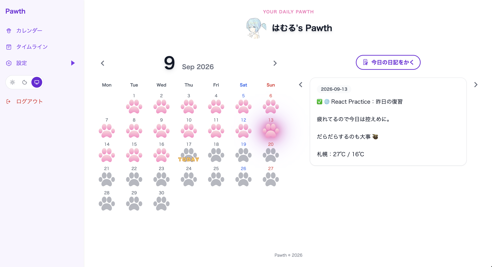
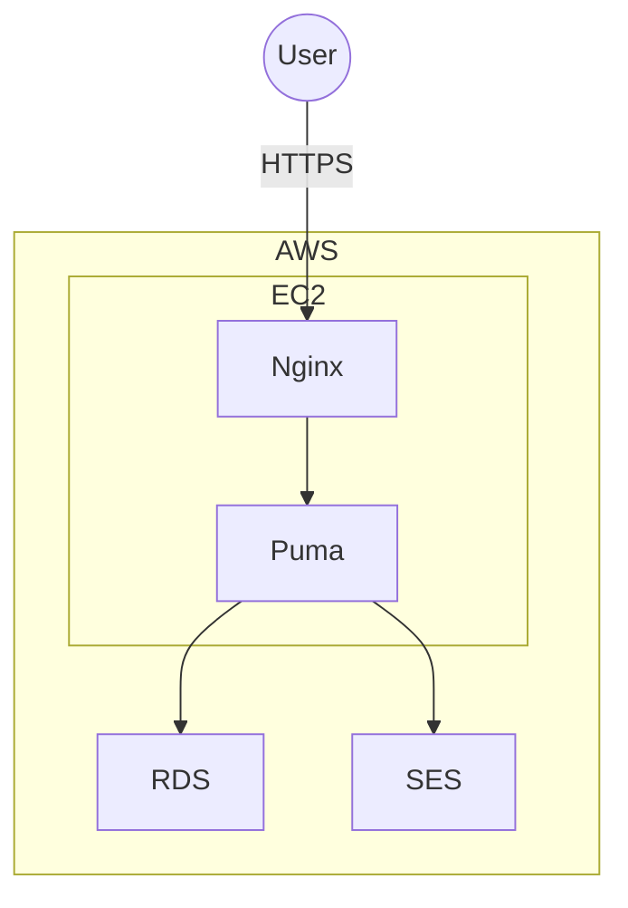

# Pawth 🐾

## 〜日々の足あとを描く〜

Pawthは、1日1回、その日の記録を残せる小さな日記アプリです。

日々の記録をカレンダーに残し、これまでの歩みを振り返ることができます。

> 🌐 紹介サイト: <https://pawth-lp.hamltail.dev/>

> [!NOTE]
> 現在、本番環境の運用は停止しています。



## 1日1投稿まで

- 投稿は1日1回まで
- 当日の投稿は3回まで編集できます
- 投稿の削除は翌日以降にできます
- 翌日以降の投稿は編集できません

## 技術スタック

| Category       | Technology                              |
| -------------- | --------------------------------------- |
| Frontend       | Haml, Tailwind CSS, Turbo, GSAP         |
| Backend        | Ruby 4.0.6, Rails 8.1.3                 |
| Database       | PostgreSQL 18                           |
| Authentication | Devise                                  |
| Testing        | RSpec, FactoryBot, Playwright, axe-core |
| Infrastructure | AWS (EC2, RDS, SES)                     |

## セットアップ

### ローカル環境

```bash
git clone https://github.com/hamltail/pawth.git
cd pawth
bundle install
npm ci
rails db:setup
bin/dev
```

### Docker

開発環境をビルドして起動します。

```bash
docker compose -f compose.dev.yml up --build -d
```

データベースをセットアップします。

```bash
docker compose -f compose.dev.yml exec web bin/rails db:migrate
docker compose -f compose.dev.yml exec web bin/rails db:seed
```

停止する場合

```bash
docker compose -f compose.dev.yml down
```

### 開発環境でのメール確認

PawthはDevise Confirmableを利用しています。

Docker開発環境では、確認メールを`letter_opener_web`から確認できます。

```text
http://localhost:3000/letter_opener
```

## 本番構成（停止中）

PawthはAWS上で以下の構成で運用していました。  
現在、本番環境の運用は停止しています。


```mermaid
flowchart TD
    User((User)) -->|HTTPS| Nginx[Nginx]
    Nginx --> Puma[Puma]
    Puma --> RDS[RDS]
    Puma --> SES[SES]

    subgraph AWS
        EC2
        RDS
        SES
    end

    subgraph EC2
        Nginx
        Puma
    end
```

## License

このリポジトリは、ポートフォリオ目的で公開しています。

著作権は作者に帰属します。  
無断転載・再配布・商用利用はご遠慮ください。

This repository is published for portfolio purposes only.

All rights to the content belong to the author.

Please do not reproduce, redistribute, or use any part of this project for commercial purposes without permission.

## Author

- h-waji (hamltail)
